# Project 3: Design Journey

Be clear and concise in your writing. Bullets points are encouraged.

**Everything, including images, must be visible in Markdown Preview.** If it's not visible in Markdown Preview, then we won't grade it. We won't give you partial credit either. This is your warning.


## Design Plan

### Project 1 or 2
> Do you plan to reuse your Project 1 or 2 site?
> Which project?
Project 2

> If yes, please include sketches of the site's current design (you may copy the "final" sections from those assignments.)
______
#### __FINAL SORT__ Card Sort 5:

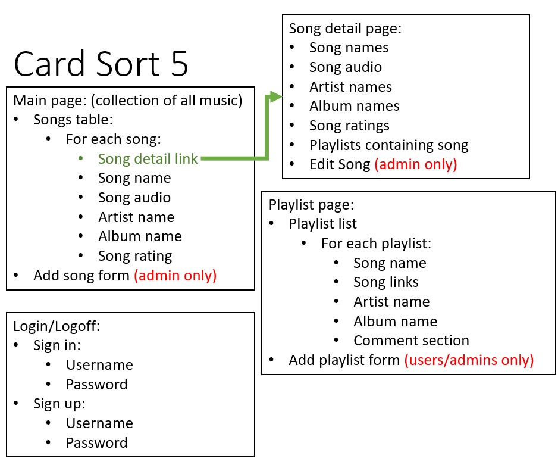

For the fifth sort I added more features including a login/logoff, and a song detail view. This would allow a more select audeince to make changes to the form. Doing so would make it more difficult for trolls to add random songs to the site, and allow only dedicated users like admin Luis to add and edit quality music to the songs table. This satisfies Luis' main need/wants revolving around sharing his favorite music playlist with others interested in glitch vaperwave, while also satisfying Maria's need to find quality glitch vaperwave (via ensuring only those truly dedicated to glitch vaperwave can upload and edit songs). The same logic would apply to my decision to make the add playlist form limited to users and admins only. The reason why I also enable Maria to create playlists is so that users like Maria can have a way to keep track of their favorite songs that they find.

#### __FINAL DESIGN:__ Card Sort 6 Design Sketch:

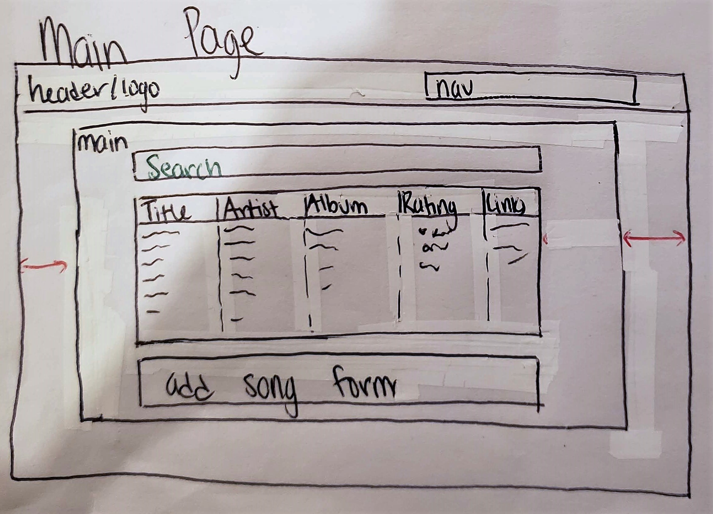

I decided to keep the created the main page from my 4th redesign. This main contained a table that held information about song names, artist names, album names, ratings, and links for each song. I made sure to make the table organized, and with enough white space such that users like Maria would not find the table cluttered. To further assist Maria in her navigation of the music I made to add a search bar and sorting mechanics. To satisfy Luis' desire/want/need to share music with people like Maria, I added an Add Song Form that would allow him to add music to the table.

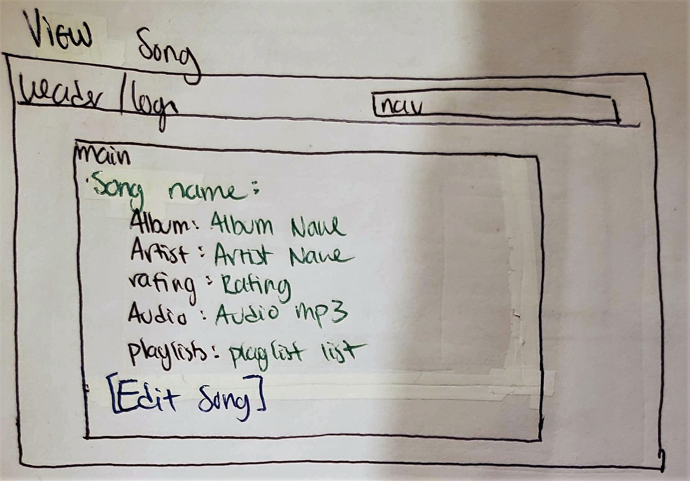

For each song I plan to enable Luis and Maria to clearly view all the details related to a particular song. This not only rearranges the details of a particular song condensed in the table in a more readable manner but also allows Luis and Maria to view which playlists a song has been added to. This features allows Maria to be able to determine which playlists to explore if she likes a particular song, and allows Luis to find out the popularity of said song. This page also has an exclusive edit song function limited only to administrators like Luis since such an action should only be done by a passionate individual to ensure the quality of such edits. (The edit song form is shown below:)

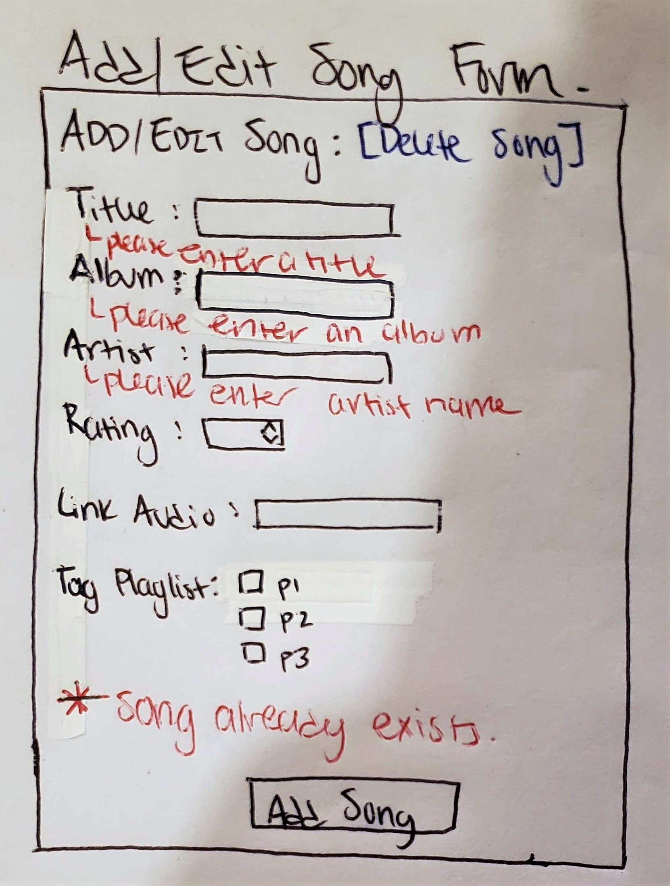

In the design for the Add/Edit Song Form I made sure to have clear and concise feedback to help guide Luis through the adding song process. I added a username and password checking to make ensure the quality of the songs added.

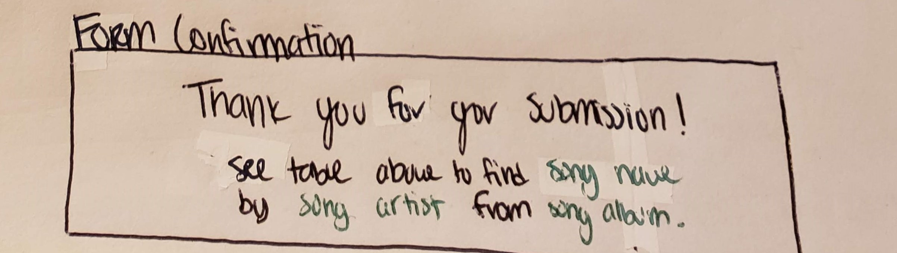

I also made sure to have a form confirmation page to ensure that Luis knows that his add song action was effective.


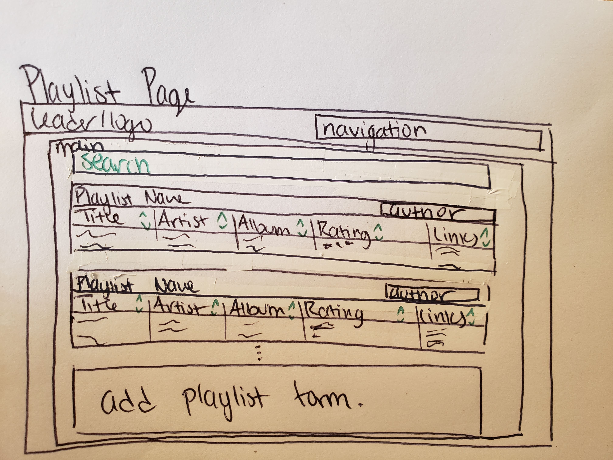

The playlist page that contains a table that hold information about song names, artist names, album names, ratings, and links for each song. The playlist page also includes a add playlist form that allows Luis to add new playlists if he chooses too. I also have a search bar on the top to allow users like Maria to search based on the Playlist name/tags.

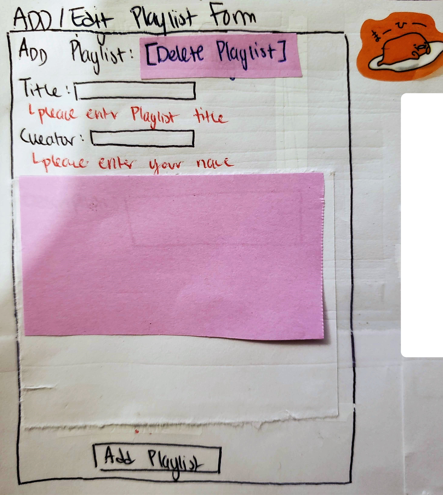

In the design for the Add Playlist Form I made sure to have clear and concise feedback to help guide Luis through the adding playlist process. I added a username and password checking to make ensure the quality of the songs added.


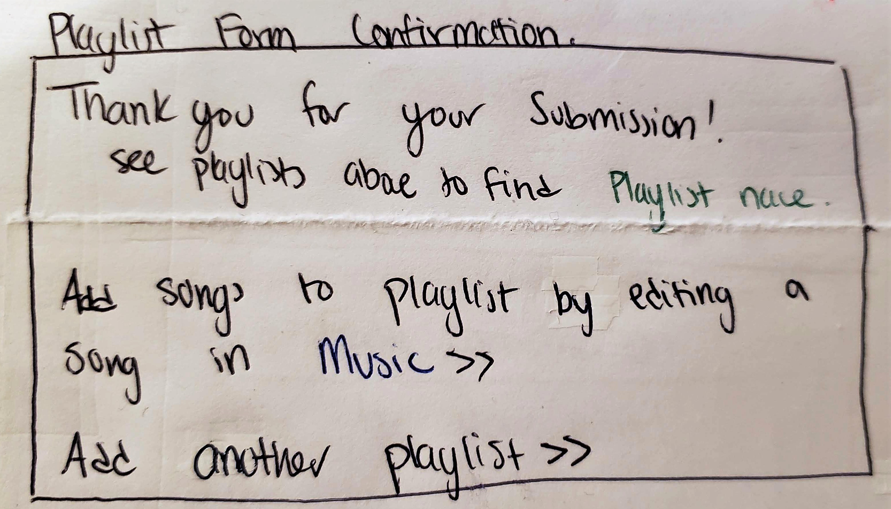

I also made sure to have a form confirmation page to ensure that Luis knows that his add playlist action was effective.

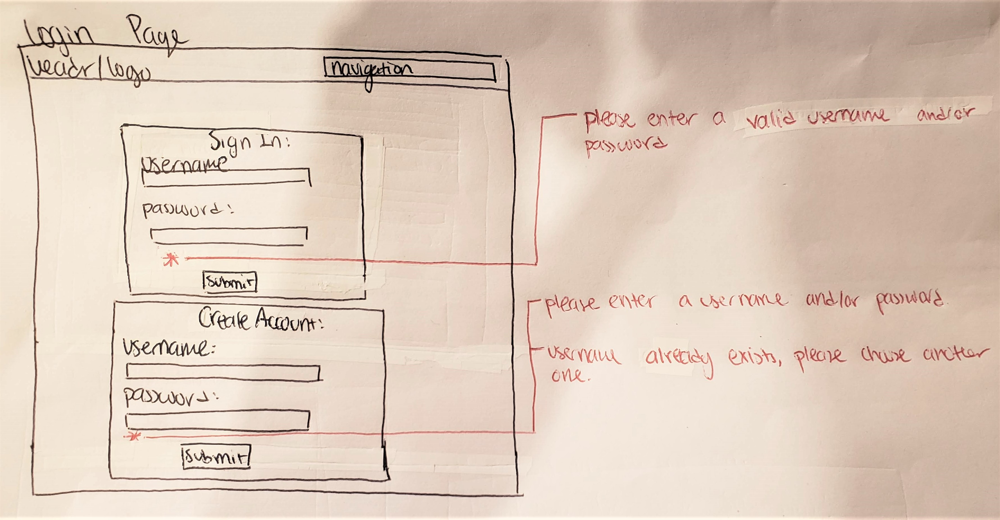

Finally, to enable sign in and keep track of who is who, I made sure to create a sign in page as well.


### Describe your Media Catalog (Milestone 1)
> What will your collection be about?
> What type of media will your site display? (images, videos, audio)

My Collection will be about showcasing the glitchvaperwave music/audio as well as the unique album covers of each song.


### Audiences (Milestone 1)
> Briefly explain your site's audiences. Be specific and justify why each audience is appropriate for your site.
> You are required to have **two** audiences: "information consumers" and "site administrators"

Information Consumer: TODO

Site Administrator: TODO


### Personas (Milestone 1)
> Your personas must have a name and a "depiction". This can be a photo of a face or a drawing, etc.
> There is no required format for the persona.
> You may type out the persona below with bullet points or include an image of the persona. Just make sure it's easy to read the persona when previewing markdown.
> Your personas should focus on the goals, obstacles, and factors that influence behavior of each audience.

> Persona for your "consumer" audience:


Persona's Name:  Maria

Factors that Influence Behavior:

- Undergraduate/student in University
- busy academic schedule
- grew up playing classic videogames on old consoles
- grew up watching anime and listening to 80's pop
- loves the nostalgia of vaperawave
- likes electronic music
- keeps a personal playlist of vaperwave on spotify, bandcamp, and youtube

Needs/Obstacles/Desires

- Wants: to find music that she relates to on a personal level (something that resonates with her affinity for old video games and 80's pop) but with a new twist
- Wants: to find glitch vaperwave music to listen to while she studies and works
- Needs: a quick way to find hot/interesting glitch vaperwave
- Obstacles: busy schedule, making it hard for her to spend too much time looking for new music to listen to


> Persona for your "administrator" audience:


Persona's Name:  Luis

Factors that Influence Behavior:

- Has a 9-5 job
- avid player of video games
- grew up watching anime and listening to 80's pop
- Spends free time perusing bandcamp and other vaperwave forums catching on the latest tunes
- keeps a personal playlist and collection of vaperwave discs and flacs on his personal computer/home
- has a hard time finding ways to share his favorite songs with other people (due to the nicheness of glitch vaperwave)

Needs/Obstacles/Desires

- Wants: to share his vaperwave music with others
- Needs: A way to upload information about the music he enjoys
- Obstacles: Does not have friends that share the same music and passion he has for vaperwave


### Site Design (Milestone 1)
> Document your _entire_ design process. **We want to see iteration!**
> Show us the evolution of your design from your first idea (sketch) to the final design you plan to implement (sketch).
> Show us the process you used to organize content and plan the navigation, if applicable (card sorting).
> Plan your URLs for the site.
> Provide a brief explanation _underneath_ each design artifact. Explain what the artifact is, how it meets the goals of your personas (**refer to your personas by name**).
> Clearly label the final design.

#### Content Brainstorm 1:

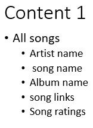

To satisfy Maria's needs I created content 1 to satisfy her desire to find new music that fall into the glitch vaperwave genre. The content above provide her with all the information she needs to find each song under the glitch vaperwave genre.

____

#### Card Sort 1:

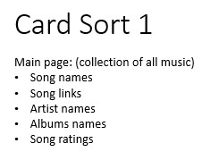

Based on content 1 I created card sort 1 that places the content 1 on the main page. The main page satisfies  Maria's busy schedule obstacle by directly presenting the latest vaperwave music to her from the start/main page.
____

#### Content Brainstorm 2:

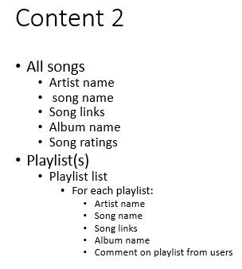

In the second content version I added Luis' main need/wants revolving around sharing his favorite music playlist with others interested in glitch vaperwave
____
#### Card Sort 2:
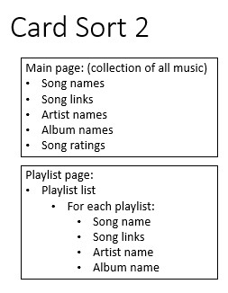

Based on content 2 I created card sort 2 that places the information about all songs, albums, song ratings etc. on the main page. On a separate page, the playlist page, I decided to have a list of all playlists in which each playlist contains song names, links, album names, and artist names. This page would satisfy Luis' want to share curated playlist with other glitch vaperwave listeners

#### Card Sort 2 Design Sketch:

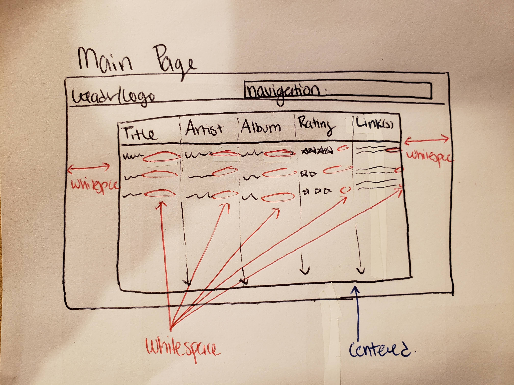

Based on card sort 2, I created the main page that contained a table that held information about song names, artist names, album names, ratings, and links for each song. I made sure to make the table organized, and with enough white space such that users like Maria would not find the table cluttered.

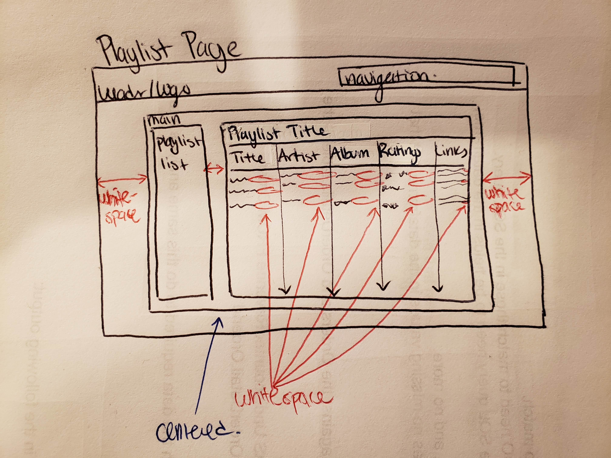

Based on card sort 2, I created the playlist page that contained a table that held information about song names, artist names, album names, ratings, and links for each song. This page also had a side bar that contained a list of playlists. I made sure to make the table organized, and with enough white space such that users like Maria would not find the table cluttered.
____

#### Content/Card Sort Brainstorm 3:
**__NOTE:__ As stated in Additional Design Justification section--due to time constraints the playlist page I was unable to fully implement the playlist page. Thus I ultimately decided to remove it. I however, made sure to add features to the Main page such that there would be no compromise on users' need/satisfaction (see below).

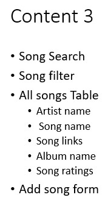

In the third content version I realized a huge flaw with my previous content sorts--I focused too much on trying to add fancy details like playlists and comments, while I forgot to include the implementation of adding a way in which Luis could add/share his music. Thus, in this content sort I decided to focus on delivering the basics to Luis and Maria. This means providing a means of searching and sorting/filtering the music for Maria to easily access and view the music, and providing a form in which Luis can fill to add new music to the table. Since this content brainstorm is for one page, this also doubles as my third card sort.

#### Card Sort 3 Design Sketch:

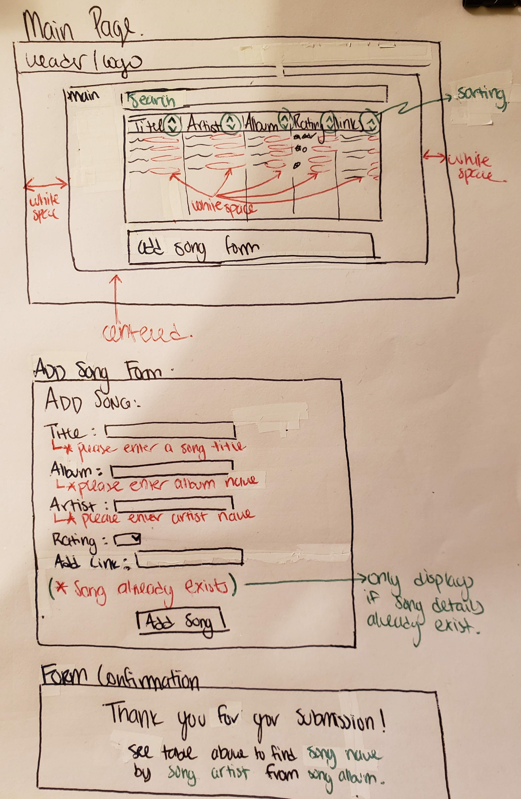

Based on card sort 3, I created the main page that contained a table that held information about song names, artist names, album names, ratings, and links for each song. I made sure to make the table organized, and with enough white space such that users like Maria would not find the table cluttered. To further assist Maria in her navigation of the music I made to add a search bar and sorting mechanics. To satisfy Luis' desire/want/need to share music with people like Maria, I added an Add Song Form that would allow him to add music to the table.

In the design for the Add Song Form I made sure to have clear and concise feedback to help guide Luis through the adding song process. I also made sure to have a form confirmation page to ensure that Luis knows that his add song action was effective.

______
#### Card Sort 4:

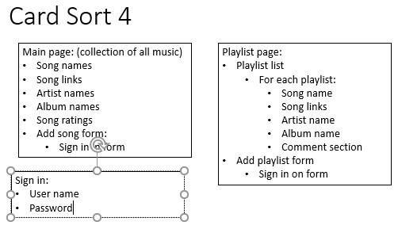

For the fourth sort I decided to return to card sort 2 since it included well flushed out considerations for a second database--the playlist database. This satisfies Luis' main need/wants revolving around sharing his favorite music playlist with others interested in glitch vaperwave. It also adds a sign in page.

____
####  Card Sort 4 Design Sketch:

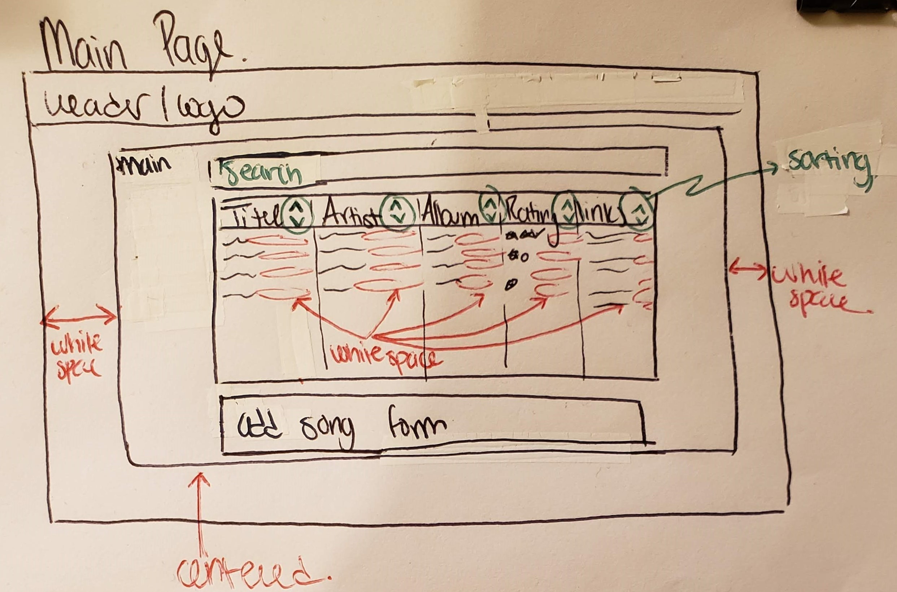

I decided to keep the created the main page from my 3rd redesign. This main contained a table that held information about song names, artist names, album names, ratings, and links for each song. I made sure to make the table organized, and with enough white space such that users like Maria would not find the table cluttered. To further assist Maria in her navigation of the music I made to add a search bar and sorting mechanics. To satisfy Luis' desire/want/need to share music with people like Maria, I added an Add Song Form that would allow him to add music to the table.
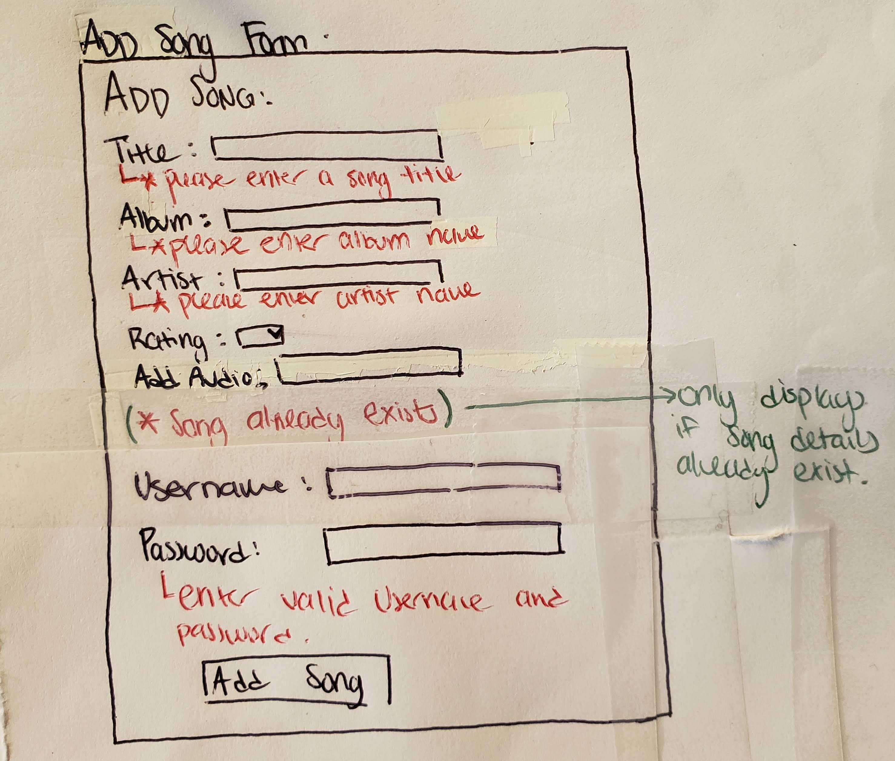

In the design for the Add Song Form I made sure to have clear and concise feedback to help guide Luis through the adding song process. I added a username and password checking to make ensure the quality of the songs added.


I also made sure to have a form confirmation page to ensure that Luis knows that his add song action was effective.


The playlist page that contains a table that hold information about song names, artist names, album names, ratings, and links for each song. The playlist page also includes a add playlist form that allows Luis to add new playlists if he chooses too. I also have a search bar on the top to allow users like Maria to search based on the Playlist name/tags.

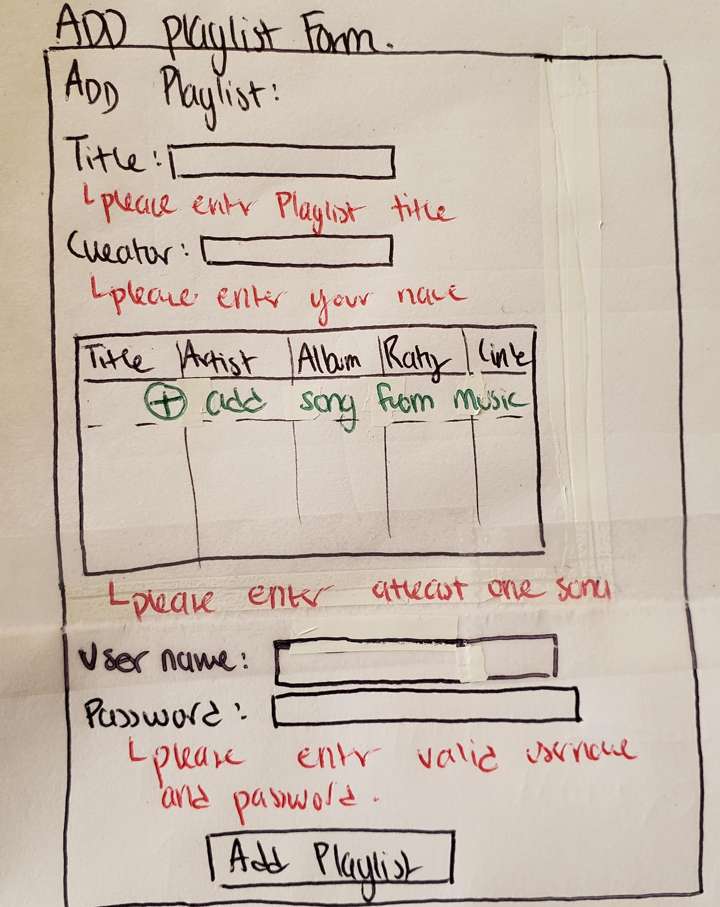

In the design for the Add Playlist Form I made sure to have clear and concise feedback to help guide Luis through the adding playlist process. I added a username and password checking to make ensure the quality of the songs added.


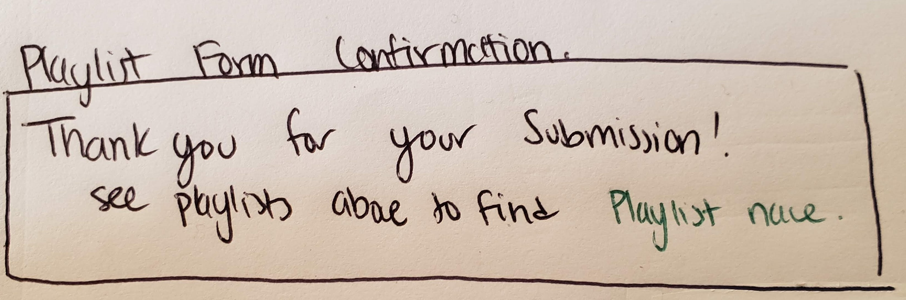

I also made sure to have a form confirmation page to ensure that Luis knows that his add playlist action was effective.

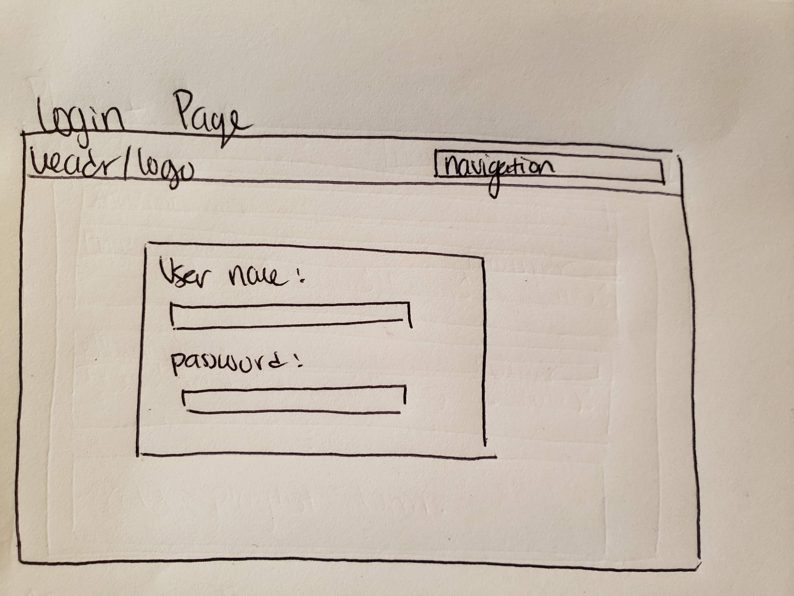

Finally, to enable sign in and keep track of who is who, I made sure to create a sign in page as well.


______
#### __FINAL SORT__ Card Sort 5:


For the fifth sort I added more features including a login/logoff, and a song detail view. This would allow a more select audeince to make changes to the form. Doing so would make it more difficult for trolls to add random songs to the site, and allow only dedicated users like admin Luis to add and edit quality music to the songs table. This satisfies Luis' main need/wants revolving around sharing his favorite music playlist with others interested in glitch vaperwave, while also satisfying Maria's need to find quality glitch vaperwave (via ensuring only those truly dedicated to glitch vaperwave can upload and edit songs). The same logic would apply to my decision to make the add playlist form limited to users and admins only. The reason why I also enable Maria to create playlists is so that users like Maria can have a way to keep track of their favorite songs that they find.

____
####  Card Sort 5 Design Sketch:


I decided to keep the created the main page from my 4th redesign. This main contained a table that held information about song names, artist names, album names, ratings, and links for each song. I made sure to make the table organized, and with enough white space such that users like Maria would not find the table cluttered. To further assist Maria in her navigation of the music I made to add a search bar and sorting mechanics. To satisfy Luis' desire/want/need to share music with people like Maria, I added an Add Song Form that would allow him to add music to the table.

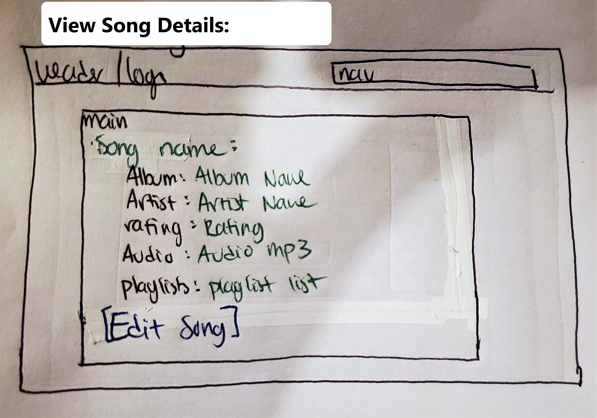

For each song I plan to enable Luis and Maria to clearly view all the details related to a particular song. This not only rearranges the details of a particular song condensed in the table in a more readable manner but also allows Luis and Maria to view which playlists a song has been added to. This features allows Maria to be able to determine which playlists to explore if she likes a particular song, and allows Luis to find out the popularity of said song. This page also has an exclusive edit song function limited only to administrators like Luis since such an action should only be done by a passionate individual to ensure the quality of such edits. (The edit song form is shown below:)

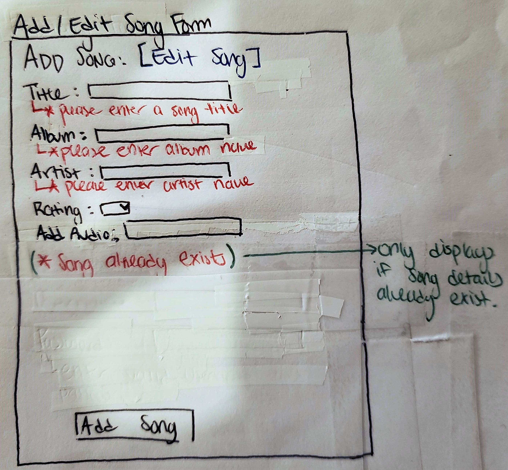

In the design for the Add/Edit Song Form I made sure to have clear and concise feedback to help guide Luis through the adding song process. I added a username and password checking to make ensure the quality of the songs added.


I also made sure to have a form confirmation page to ensure that Luis knows that his add song action was effective.


The playlist page that contains a table that hold information about song names, artist names, album names, ratings, and links for each song. The playlist page also includes a add playlist form that allows Luis to add new playlists if he chooses too. I also have a search bar on the top to allow users like Maria to search based on the Playlist name/tags.

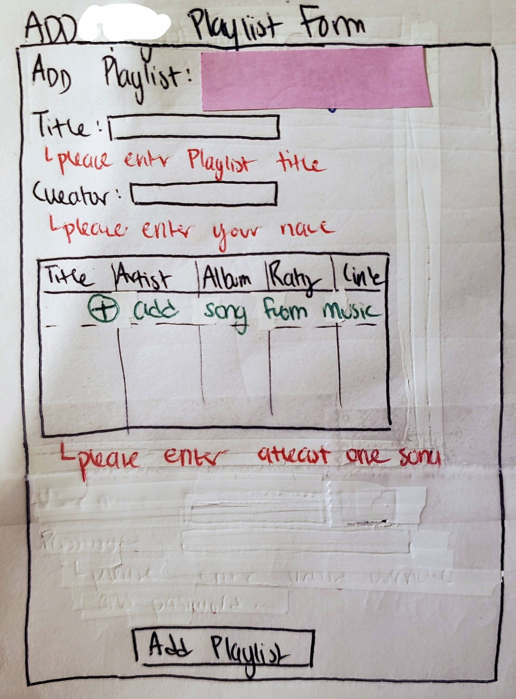

In the design for the Add Playlist Form I made sure to have clear and concise feedback to help guide Luis through the adding playlist process. I added a username and password checking to make ensure the quality of the songs added.


I also made sure to have a form confirmation page to ensure that Luis knows that his add playlist action was effective.


Finally, to enable sign in and keep track of who is who, I made sure to create a sign in page as well.


__
#### __FINAL DESIGN:__ Card Sort 6 Design Sketch:


I decided to keep the created the main page from my 4th redesign. This main contained a table that held information about song names, artist names, album names, ratings, and links for each song. I made sure to make the table organized, and with enough white space such that users like Maria would not find the table cluttered. To further assist Maria in her navigation of the music I made to add a search bar and sorting mechanics. To satisfy Luis' desire/want/need to share music with people like Maria, I added an Add Song Form that would allow him to add music to the table.


For each song I plan to enable Luis and Maria to clearly view all the details related to a particular song. This not only rearranges the details of a particular song condensed in the table in a more readable manner but also allows Luis and Maria to view which playlists a song has been added to. This features allows Maria to be able to determine which playlists to explore if she likes a particular song, and allows Luis to find out the popularity of said song. This page also has an exclusive edit song function limited only to administrators like Luis since such an action should only be done by a passionate individual to ensure the quality of such edits. (The edit song form is shown below:)


In the design for the Add/Edit Song Form I made sure to have clear and concise feedback to help guide Luis through the adding song process. I added a username and password checking to make ensure the quality of the songs added.


I also made sure to have a form confirmation page to ensure that Luis knows that his add song action was effective.


The playlist page that contains a table that hold information about song names, artist names, album names, ratings, and links for each song. The playlist page also includes a add playlist form that allows Luis to add new playlists if he chooses too. I also have a search bar on the top to allow users like Maria to search based on the Playlist name/tags.


In the design for the Add Playlist Form I made sure to have clear and concise feedback to help guide Luis through the adding playlist process. I added a username and password checking to make ensure the quality of the songs added.


I also made sure to have a form confirmation page to ensure that Luis knows that his add playlist action was effective.


Finally, to enable sign in and keep track of who is who, I made sure to create a sign in page as well.
#### URL Design

 1) index.php -- /home
 2) playlist.php -- /playlist
 3) song.php--/song
 4) user.php--/sign-in
 5) all else--/404


### Design Patterns (Milestone 1)
> Write a one paragraph reflection explaining how you used the design patterns in your site's design.


I used the design patterns from Spotify to assist in my design patterns for my album tables and playlist tables. I choose to model my design after Spotify due to how well they utilize white space to present long lists of information about music. Despite having a long catalog, their tables are still readable and easy to navigate.


## Implementation Plan

### Requests (Milestone 1. Revise in Milestone 2)
> Identify and plan each request you will support in your design.
> List each request that you will need (e.g. view image details, view gallery, edit book, tag product, etc.)
> For each request, specify the request type (GET or POST), how you will initiate the request: (form or query string URL), and the HTTP parameters necessary for the request.

- Request: view song details
  - Type: GET
  - URL: /songs/details?id=X
  - Params: id _or_ song_id (songs.id in DB)

- Request: view playlist details
  - Type: GET
  - URL: /playlist/details?id=X
  - Params: id _or_ playlist_id (playlists.id in DB)

- Request: open song details
  - Type: GET
  - URL: /playlist/song?id=X
  - URL: /music/song?id=X
  - Params: id _or_ song_id (songs.id in DB)


### Database Schema (Milestone 1. Revise in Milestone 2)
> Describe the structure of your database. You may use words or a picture. A bulleted list is probably the simplest way to do this. Make sure you include constraints for each field.

> Hint: You probably need a table for "entries", `tags`, `"entry"_tags` (stores relationship between entries and tags), and a `users` tables.

> Hint: For foreign keys, use the singular name of the table + _id. For example: `image_id` and `tag_id` for the `image_tags` (tags for each image) table.

Table: Songs
- id: INTEGER {PK, U, NN, AI}
- title: TEXT {NN},
- album: TEXT {NN}
- playlist_id: INTEGER {NN}
- artist: TEXT {NN}
- rating: INTEGER {}
- file_name    TEXT
- file_ext    TEXT,
- source      TEXT,

Table: Playlists (my tag)
- id: INTEGER {PK, NN, AI}
- name: TEXT {NN}
- author: NAME {}
- user_id: INTEGER{NN}

Table: Users
- id: INTEGER {PK, NN, AI, U}
- name: TEXT {NN}
- username: TEXT {NN, U}
- password: TEXT {NN, U}

Table: Groups
- id: INTEGER {NN, PK, AI, U}
- name: TEXT  {NN, U}

Table: Memberships
- id: INTEGER {NN, PK, AI, U}
- group_id: INTEGER {NN}
- user_id: INTEGER {NN}


Table: sessions
- id: INTEGER {NN, PK, AI, U}
- user_id: INTEGER {NN}
- last_login: TEXT {NN}

Table: mapper
- id: INTEGER {NN,U,PK,AI}
- playlist_id: INTEGER{NN}
- song_id: INTEGER {NN
- }
### Database Query Plan (Milestone 1. Revise in Milestone 2)
> Plan your database queries. You may use natural language, pseudocode, or SQL.

1. All records (Songs)

    ```SQL
    SELECT * FROM Songs
    ```

2. Insert record (Songs)

    ```SQL
    INSERT INTO Songs (title,album,artist,rating,links)
    VALUES (footitle, fooalbum, fooartist, foorating, foolinks)

    ```

3. Search records (Songs)

    ```SQL
   WHERE ((title LIKE '%' || :search || '%') OR (album LIKE '%' || :search || '%') OR (link LIKE '%' || :search || '%'))
    ```

4. Sort record by title (Songs)
    ```SQL
    SELECT * FROM Songs
    ORDER BY title ASC
    ```
5. Sort record by artist (Songs)
    ```SQL
    SELECT * FROM Songs
    ORDER BY artist ASC
    ```
6. Sort record by album (Songs)
    ```SQL
    SELECT * FROM Songs
    ORDER BY album ASC
    ```
7. Sort record by link (Songs)
    ```SQL
    SELECT * FROM Songs
    ORDER BY link
    ```
8. Sort record by rating (Songs)
    ```SQL
    SELECT * FROM Songs
    ORDER BY rating ASC
    ```
9. All records (Playlist)
     ```SQL
    SELECT * FROM Playlist
    ```
10. Insert record (Playlist)
    ```SQL
    INSERT INTO Playlist (id, author)
    VALUES (fooid, fooauthor)
    ```

11. Insert Playlist id into Songs (Playlist)
    ```SQL
    INSERT INTO Songs (playlist_id)
    VALUES (fooplaylist)
    WHERE Songs.title = playlist_song_name AND Songs.album = playlist_song_album AND Songs.artist = playlist_song_artist
    FROM Songs
    ```
12. Get all administrators (users)
 ```SQL
    SELECT * FROM users
  ```
13. Check if user is administrator (users)
 ```SQL
    SELECT * FROM users WHERE user= user_id
 ```
14. Get Playlists for Songs (Songs, playlist)
 ```SQL
    SELECT playlists.title FROM songs
    LEFT JOIN playlists
    ON playlists.id = songs.playlist_id
    WHERE songs.id = song_id
 ```

 15.  Get All records for groups
 ```SQL
    SELECT * FROM groups
 ```

 16.  Get All records for sessions
 ```SQL
    SELECT * FROM sessions
 ```

  17.  Get All records for memberships
 ```SQL
    SELECT * FROM memberships
 ```
18. Get songs of a playlist from mapper
  ``` SQL
  SELECT songs.title, artist, album, rating, file_name
  FROM songs INNER JOIN mapper
  ON mapper.song_id = songs.id
  INNER JOIN playlists
  ON mapper.playlist_id = playlists.id
  WHERE playlists.id = fooplaylist
  ```
19. Get all playlists for song:

  ```SQL
  SELECT playlists.title
  FROM songs INNER JOIN mapper
  ON mapper.song_id = songs.id
  INNER JOIN playlists
  ON mapper.playlist_id = playlists.id
  WHERE songs.id = 1;
  ```

19. Delete songs from Mapper:

  ```SQL
  DELETE FROM mapper WHERE song_id=:song_id;
  ```
20. Delete songs from songs:
     ```SQL
  DELETE FROM songs WHERE id=:song_id;
  ```
### Code Planning (Milestone 1. Revise in Milestone 2)
> Plan any PHP code you'll need here using pseudocode.
> Use this space to plan out your form validation and assembling the SQL queries, etc.
> Tip: Break this up by pages. It makes it easier to plan.

FORM FEEDBACK:
```PHP
  When user submits form:
    Let variable formValid be true
    if user is administrator (use sql from above):
      HIde user feedback
    else
      show user feedback
      formValid be false

    if Song title is not empty:
      Hide title feedback
    else
      Show title feedback
      Let variable formValid be false

    if Song artist is not empty:
      Hide artist feedback
    else
      Show artist feedback
      Let variable formValid be false

    if Song album is not empty:
      Hide album feedback
    else
      Show album feedback
      Let variable formValid be false

    if Array of Songs with title, artist and album  is not empty:
      Hide repetition of song feedback
    else
      Show repetition of song feedback
      Let variable formValid be false

    return formValid;

if ($formValid){
    execute sql query of insert (see above)
}
else{
  set sticky values for:
    - artist
    -title
    -album
    - link
    - rating
    - sort
    - search
}
```

SEARCH PHP:
```PHP
$search_terms = Get q
if (search_terms is empty){
  $search_terms = NULL;
}
else{
  $sql_select_query = sql_select_query. SELECT... (see above search query)

  keep track of whether sql has WHERE and SEARCH
}

  $sort_query_string = http build query with an array of table parameters
  $sort_url= '/home' . sort_query_string
```

SORT PHP:
```PHP
  $sort = Get sort value
  $order = Get order value

  $sort_css_buttons = array(
    FALSE/TRUE for all asc and desc table parameters
  )

  $next_sort_url = array(
    All table parameters => asc
  )

  if ($order is 'asc'){
    Set sql order command to 'ASC';
    Set next sort to desc

    Set filter icon to go up
  }
  else if ($order is 'desc'){
    Set sql order command to 'DESC';
    set next sort to be NULL
  }
  else{
    set both order and sort to NULL;
  }

  foreach (table parameter){
    if (sort == table parameter){
      $sql_select_query = sql_select_query. "SELECT * FROM ORDER BY" . table parameter . order command
    }
  }

  $next_sort_url[table parameter]= next sort;

```

EXECUTION PHP:
``` PHP
$records = executle sql query for database, sql_select_query, and sql_search
```

LOGIN PHP
``` PHP
if (!is_user_signedin()){
  Sign in HTML
  echo_login_form('/login', $session_messages);
  Sign up HTML
  echo_signup_form('/login', $session_messages);
}
else{
  Redirect PHP to home
}
```

LINK TO MUSIC DESCRIPTION PHP
``` PHP
for each song title{
  echo http_build_query(array('id' => $record['id']));
}
```

SONG DESCRIPTION PHP
``` PHP
$song_id = (int)trim($_GET['id']);

if ($song_id exists){
  $records = execute_sql_query(
    "SELECT * FROM WHERE id = :id"
    where :id -> $song_id)-> fetchAll;
  if ($records count >0){
    let $song = $records;
  }else{
    $song is NULL
  }

  if ($song is valid){
    Generate hidden feedback message for title, artist, album, unique
    (FORM for editing is almost the exact same as the form for adding songs)

    Set sticky title, artist, album, link, and ratings to corresponding song['param'] value

    initialize form values:
    $title = '';
    $artist = '';
    $album = '';
    $rating = '';
    $link = '';
    $show_confirmation = False;
    $show_form = True;

    if(song was saved){
      SET title, artist, album, rating and link to inputted edit form values
      (trim($_POST['param']) format)

      $form_valid = True;

      SEE FORM LOGIC ABOVE FOR REST OF EDIT FORM
    }


}
```
ADD/UPLOAD SONG MP3
```PHP
  $upload = $_FILE['mp3'];
   if($upload['error']==ERROR_OK){
      $upload_filename=$upload['name'];
      $upload_ext = file extension of $upload_filename;
      // Check if extension is mp3
      if($upload_ext!='mp3'){
        $form_valid=false;

      }
      // Check that source is NOT empty--if upload mp3 must site your source
      if (empty($source)) {
        $form_valid = False;
        $source_feedback_class = '';
    }
  }
```

UPDATE ENTRIES
``` PHP
 if ($form_valid) {
   $db -> begin transaction;
   exec_sql_query("UPDATE SONG SQL");
   $record_id = $db->lastInsertId('id')
   //Remove all mapper values with song_id
   exec_sql_query("DELETE SONG FROM MAPPER SQL");
   // Add playlists and song values back into mapper for each playlist added to song
   foreach($add_playlist_array as $p){
     exec_sql_query("INSERT SONG AND PLAYLIST INTO MAPPER SQL");
   }

   if (all exec_sql_query succeeds){
     $id_filename = 'public/uploads/documents/' . $song_id . '.mp3';
        // Move the file to the uploads/documents folder
      unlink($id_filename);
      move_uploaded_file($upload["tmp_name"], $id_filename);
   }
  $db-> commit();
 }
```

## Submission

### Audience (Final Submission)
> Tell us how your final site meets the needs of the audiences. Be specific here. Tell us how you tailored your design, content, etc. to make your website usable for your personas. Refer to the personas by name.

My site satisfies the needs of Luis (the administrator) by allowing him to view all songs and add new songs on the music page. This satisifies his need to catalog and share his favorite tunes. This functionality is restrited to only administrators to satisfy Maria's need to find the best and the newest relevent songs. She does not have time to filter through mediocre recommendations or irrelevent entries entered by those who are not as well-versed in Glitch-Wave music. The site also satisifies Maria's need to view well-curated songs efficiently by presenting all song entries in a well ordered and sortable table in the Home Page with a search bar enabling her to find the songs she needs. Maria's need for curation is also satisfied by her ability to view tagged songs on the playlist page in which songs are catagorized and tagged together into groups. Maria can also create new tags/playlists in which Luis can populate with music. Luis' need to share his curated music is also satisfied on the Playlist page. Here he can also create playlists to share his own favorite Glitch Wave Songs.


### Additional Design Justifications (Final Submission)
> If you feel like you haven’t fully explained your design choices in the final submission, or you want to explain some functions in your site (e.g., if you feel like you make a special design choice which might not meet the final requirement), you can use the additional design justifications to justify your design choices. Remember, this is place for you to justify your design choices which you haven’t covered in the design journey. You don’t need to fill out this section if you think all design choices have been well explained in the design journey.

No


### Self-Reflection (Final Submission)
> Reflect on what you learned during this assignment. How have you improved from Project 1? What things did you have trouble with?

I have improved my understanding of SQL. In the beginning I had trouble with finding a good system of tables to relate my tags and entries together. Through thorough planning, however, I realized that the best way in which to achieve this is via creating intermediary tables (i.e. see my mapper table).


### Grading: Mobile or Desktop (Final Submission)
> When we grade your final site, should we grade this with a mobile screen size or a desktop screen size?

Web


### Grading: Step-by-Step Instructions (Final Submission)
> Write step-by-step instructions for the graders.
> The project if very hard to grade if we don't understand how your site works.
> For example, you must login before you can delete.
> For each set of instructions, assume the grader is starting from /

Viewing all entries:
1. Go to /home or click on the Music link in navigation

View all entries for a tag:
1. Go to /playlist or click on Playlist link in navigation

View a single entry and all the tags for that entry:
1. Click on song title in table located in /home

How to insert and upload a new entry:
1. Go to /home
2. Insert Title
3. Insert Album
4. Insert Artist
5. Make sure the three values above are unique/are filled in
6. Add playlists if needed
7. Add rating if needed
8. Upload MP3 if needed
9. If you uploaded MP3 make sure to upload a Source
10. Click "Add Song"

How to delete an entry:
1. Go to /home
2. Select desired entry
3. Click "Delete Song"

How to view all tags at once:
1. Go to /laylist

How to add a tag to an existing entry:
1. Go to /home
2. Select existing tags plus the tag you wish to add
3. Click "Edit Song"

How to remove a tag from an existing entry:
1. Go to /home
2. Select existing tags minus the tag you wish to add
3. Click "Edit Song"
